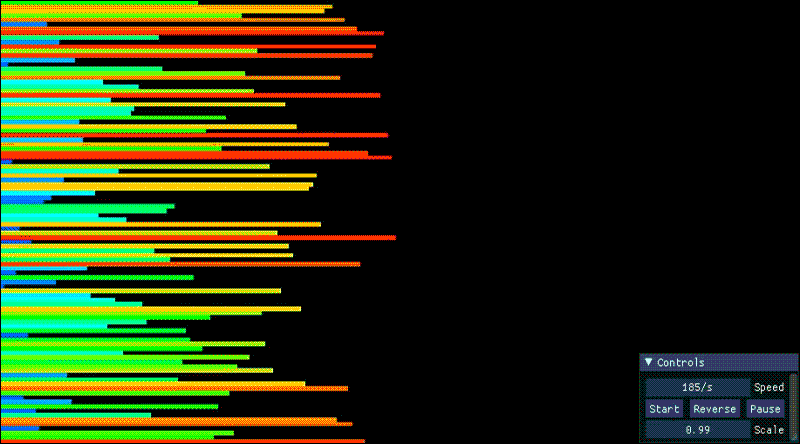

# 42 Cursus - push_swap


O objetivo deste projeto é estudar sobre algoritmos de ordenação e suas complexidades. A tarefa é 'simples': dada uma sequência de números aleatórios (posivitos e negativos, mas não repetidos), o programa deve organizá-los de forma crescente na pilha A usando apenas um conjunto de movimentos específicos e uma pilha auxiliar B. Opcionalmente também pode ser criado outro programa, o **checker**, que execute os movimentos informados pelo **push_swap** e valide se os números foram corretamente ordenados.

## Movimentações 

- **`sa` (swap a)**: Troca de posição os dois primeiros elementos da pilha A.

- **`sb` (swap b)**: Troca de posição os dois primeiros elementos da pilha B.

- **`ss` (swap a and swap b)**: Faz os movimentos `sa` e `sb` ao mesmo tempo.

- **`pa` (push a)**: Pega o primeiro elemento do topo da pilha B e coloca no topo da pilha A.

- **`pb` (push b)**: Pega o primeiro elemento do topo da pilha A e coloca no topo da pilha B.

- **`ra` (rotate a)**: Sobe todos os elementos da pilha A em 1 nível (o primeiro elemento se torna o último).

- **`rb` (rotate b)**: Sobe todos os elementos da pilha B em 1 nível (o primeiro elemento se torna o último).

- **`rr` (rotate a and rotate b)**: Faz os movimentos `ra` e `rb` ao mesmo tempo.

- **`rra` (reverse rotate a)**: Desce todos os elementos da pilha A em 1 nível (o último elemento se torna o primeiro).

- **`rrb` (reverse rotate b)**: Desce todos os elementos da pilha B em 1 nível (o último elemento se torna o primeiro).

- **`rrr` (reverse rotate a and reverse rotate b)**: Faz os movimentos `rra` e `rrb` ao mesmo tempo.

> Requer conhecimento de estruturas de dados, algoritmos de ordenação e programação em C.

___


## Push Swap

Através dos argumentos de linhas de comando (argv), o programa recebe os números inteiros positivos ou negativos, sem duplicatas, e executa os movimentos necessários para ordená-los. Apenas as instruções são impressas no terminal (stdout), e ao final delas, todos os números estarão em em ordem crescente na pilha A, enquanto a pilha B estará vazia.

Em caso de erro, como por exemplo no caso de entrada de números repetidos, que não caibam em um inteiro de 4 bytes, ou entradas não numéricas, o programa imprimirá "Error" através da saída padrão de erros (stderr).

Este projeto está conforme os padrões da Norminette (com exceção dos printers e comentários), e de acordo com as regras do desafio, sendo permitidas somente as funções `write`, `read`, `malloc`, `free` e `exit`, e proibidas as demais funções e bibliotecas.

### Compilação e Execução

1. Primeiro é necessário compilar:

```
make
```

- A execução do comando `make` gera o programa `push_swap`.

> O comando deve ser feito na raiz do projeto.

> É necessário ter o `make` e o `clang` instalados.

2. Agora é só executar o programa:

```
./push_swap 895 0 3 12 7

pb
pb
sa
ra
pa
pa
ra
```

___


## Checker

Para conferir se um conjunto de instruções é válido ou não, pode ser utilizado o **checker**. Também por meio de linhas de comando (argv), o programa recebe os mesmos números utilizados no Push Swap, e através da entrada padrão (stdin), no terminal, são digitadas as operações. Se a pilha for corretamente ordenada, o Checker imprimirá "OK", caso contrário "KO".

Assim como o Push Swap, imprime "Error" na saída padrão de erros (stderr), e segue os padrões da Norminette e regras do desafio (funções permitidas: `write`, `read`, `malloc`, `free` e `exit`).


### Compilação e Execução

1. Primeiro é necessário compilar:

```
make bonus
```

- A execução do comando `make bonus` gera o programa `checker`.

> O comando deve ser feito na raiz do projeto.

> É necessário ter o `make` e o `clang` instalados.

2. Agora é só executar o programa:

- Digite as instruções, uma a uma, enquanto o progrma estiver em execução.

- Para interromper o processo, utilize o comando `ctrl + D`, e o resultado (**OK** ou **KO**) será impresso na tela.

```
./checker 895 0 3 12 7
pb
pb
sa
ra
pa
pa
ra

OK
```

Se a quantidade de instruções for muito grande, é possível passar a saída do Push Swap diretamente para o Checker:

```
./push_swap 7358 0 -1 3 | ./checker 7358 0 -1 3

OK
```

ou ainda:

```
NUM="7358 0 -1 3"; ./push_swap $NUM | ./checker $NUM

OK
```
___

## Gerador de números

No terminal, utilize o comando:

```
shuf -i 0-1000 -n 30 | tr "\n" " "
```

- `-i` (**input range**): Define o range, entre 0 e 1000.
- `-n` (**number**): Quantidade de números exibidos a partir do primeiro.
___

## Testers utilizados

- [Push Swap Visualizer](https://github.com/o-reo/push_swap_visualizer)
- [Push Swap Tester](https://github.com/laisarena/push_swap_tester)
- [Push Swap Averager](https://github.com/Vinni-Cedraz/push_swap_averager)
___

## Visualização

<div align="center">



</div>
